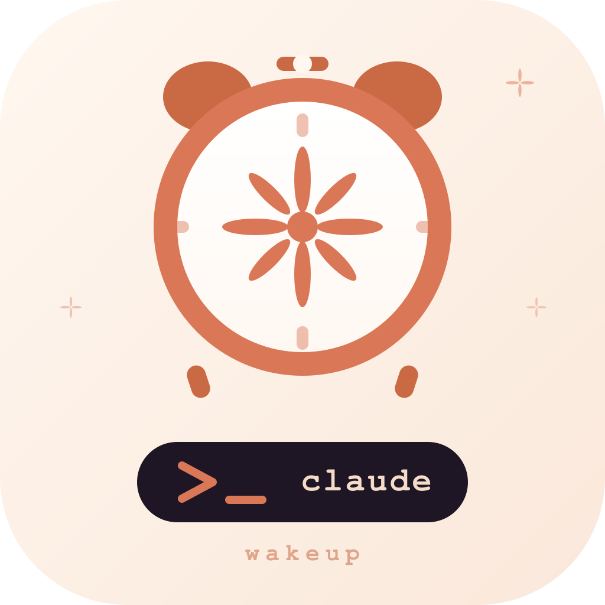
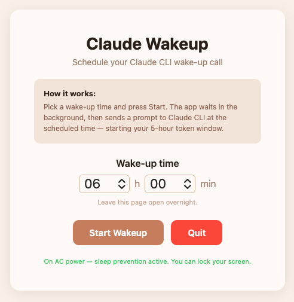
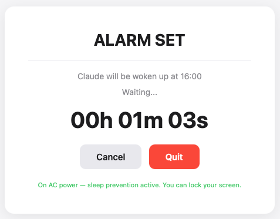
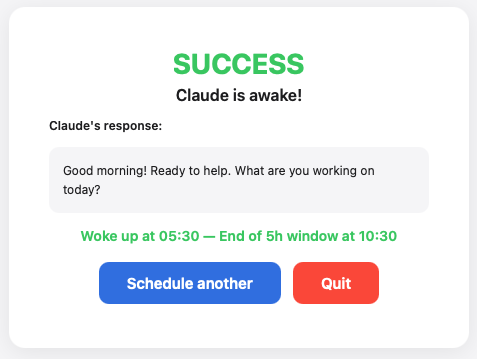
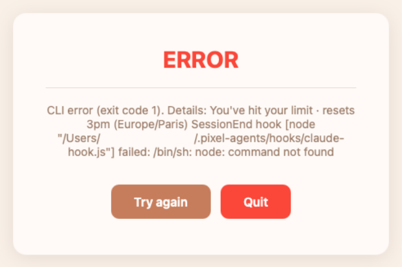

# claude-wakeup

<p align="center">
  
</p>

Claude CLI usage is allocated in 5-hour windows: once you send your first
prompt of the day, the clock starts. If that first prompt lands at 9 AM, your
window closes at 2 PM. Send it at 6 AM instead, and you have until 11 AM —
a much more useful working block for most people.

claude-wakeup automates this. You schedule a wake-up time the night before,
and the script sends the opening prompt for you at exactly the right moment,
so your window is already running when you sit down to work.

Schedule a morning wake-up call for Claude CLI from the command line, a
lightweight browser GUI, or platform-specific click-to-run launchers.

The project provides three ways to do the exact same thing:

- `claude_wakeup.py` for command-line usage
- `claude_wakeup_gui.py` for browser-based usage
- click-to-run launcher files for macOS and Windows

## Overview

The core behavior is always the same:

1. You launch the script the night before, or any time before the target time
2. The script waits until the scheduled time
3. It sends a single prompt to Claude CLI:
   ```bash
   claude -p "Good morning Claude, time to wake up!"
   ```
4. Your Claude usage window is open for the day

## Requirements

- Python 3.9+
- Claude CLI installed and available in your `PATH`

> Depending on your system and how Python was installed, you may need to
> replace `python` with `python3` (or another local alias) in all commands
> below.

### Installing Claude CLI

Claude CLI is the [Claude Code](https://code.claude.com/docs/en/quickstart)
command-line tool by Anthropic.

#### macOS

```bash
curl -fsSL https://claude.ai/install.sh | bash
```

#### Windows

```powershell
irm https://claude.ai/install.ps1 | iex
```

After installation, verify it works:

```bash
claude --version
claude doctor
```

For more installation details and troubleshooting:
[code.claude.com/docs/en/setup](https://code.claude.com/docs/en/setup)

## Installation

```bash
git clone https://github.com/MartinG-38/claude-wakeup.git
cd claude-wakeup
```

No external dependencies are required. Both scripts use only the Python
standard library.

## First-Time Setup

Before using either the command-line script, the browser GUI, or the click-to-run
launchers, you should authorize Claude CLI in this project directory once.

1. Open a terminal
2. Move into the project folder
3. Launch `claude`
4. Confirm the trust prompt for this folder

```bash
cd claude-wakeup
claude
```

After that first trust step, you can use the launchers below without needing
to `cd` into the project each time.

## Part 1 — Command-Line Version

This section covers `claude_wakeup.py`.

### Launch

```bash
# Trigger at 06:00
python claude_wakeup.py

# Trigger at a custom time
python claude_wakeup.py --time 07:30
python claude_wakeup.py --time 05:45
```

### How It Works

The command-line version:

- reads the time passed with `--time`, or uses `06:00` by default
- schedules the wake-up for the next day if today's time has already passed
- waits silently until the scheduled time
- launches Claude CLI at the chosen time
- prints simple status messages in the terminal

### Available Option

| Option | Default value | Description |
|------|---------|-------------|
| `--time HH:MM` | `06:00` | Wake-up time in 24-hour format |

### Example Output

```text
⏳ Waking up at 06:00 (7h23min remaining)
🔔 06:00! Starting Claude...
✅ Done! 5-hour window started.
```

### Background Execution

If you want the script to keep running after you close the terminal:

```bash
nohup python claude_wakeup.py --time 06:00 > wakeup.log 2>&1 &
```

If you plan to keep the terminal open:

```bash
python claude_wakeup.py --time 06:00 &
```

## Part 2 — Browser Interface Version

This section covers `claude_wakeup_gui.py`.

This version does the same job as `claude_wakeup.py`, but through a light
browser-based interface.

### Launch

```bash
python claude_wakeup_gui.py
```

When started, the script:

1. starts a small local server on `127.0.0.1:18923`
2. automatically opens your default browser
3. displays the wake-up scheduling interface
4. tries to keep the computer awake while waiting

### Interface Preview

#### Main Screen

This is the screen you see when the app opens. You choose the wake-up time
and start the schedule from here.

<p align="center">
  
</p>

#### Waiting Screen

Once a wake-up time has been scheduled, the interface switches to a live
countdown screen.

<p align="center">
  
</p>

#### Success Screen

When the wake-up succeeds, the app shows Claude's response, the wake-up time,
and the end of the 5-hour window.

<p align="center">
  
</p>

#### Error Screen

If Claude CLI fails, the app displays an error screen. This includes common
CLI failures and request-limit or quota-related errors.

<p align="center">
  
</p>

#### Goodbye Screen

When you quit from the browser, the app confirms that the local server has
stopped and the tab can be closed.

<p align="center">
  
</p>

### How The Interface Works

The interface follows a simple flow:

1. You choose the wake-up hour and minutes
2. You click `Start Wakeup`
3. A live countdown is displayed until the scheduled time
4. At the scheduled time, the script sends the prompt to Claude CLI
5. The final screen shows either success or an error

If the selected time has already passed for today, the wake-up is
automatically scheduled for the next day.

### Interface Screens

- `Main screen`: choose the time and start the schedule
- `Waiting screen`: shows the live countdown
- `Waking screen`: appears while the prompt is being sent to Claude CLI
- `Success screen`: shows Claude's response, the wake-up time, and the estimated end of the 5-hour window
- `Error screen`: shows an error message if something fails

### Available Buttons

- `Start Wakeup`: starts the schedule
- `Cancel`: cancels the current countdown
- `Schedule another`: returns to the start screen after a successful run
- `Quit`: stops the local server and lets you close the tab

### Useful Details

- Minutes can be selected in 5-minute increments
- The browser tab acts as the app's control surface
- You can lock the screen while waiting
- On a laptop, avoid closing the lid overnight

### Sleep Prevention

The interface version tries to keep the machine awake:

- on macOS, via `caffeinate`
- on Windows, via `SetThreadExecutionState`
- on other systems, the script still works but does not include built-in sleep prevention

On macOS, the interface also detects whether the machine is on AC power or
battery and displays a warning when running on battery.

### Error Handling

The interface version handles several error cases:

- Claude CLI not found in the `PATH`
- no response within 2 minutes
- a Claude CLI error
- a missing authentication error
- a request-limit or quota-reached error

If Claude returns an error indicating that the request limit has been reached,
the interface now shows an explicit message asking you to wait until the
window or quota resets before trying again.

## Part 3 — Click-to-Run Launchers

This option is for people who want to start the GUI with a simple double-click
instead of opening a terminal and running Python manually.

The launcher files start the same browser interface as `claude_wakeup_gui.py`,
but they automatically switch into the project directory first.

### Available Launcher Files

- macOS: `Claude Wakeup macOS.command`
- Windows: `Claude Wakeup Windows.bat`

### How It Works

- both launcher files start `claude_wakeup_gui.py`
- both automatically run from the project folder
- both rely on Python being available on the machine
- both still require the one-time Claude trust step described earlier in this README

### macOS Launcher

Double-click `Claude Wakeup macOS.command` in Finder to launch the browser GUI.

- tries `python3` first
- falls back to `python` if needed
- tries to close the Terminal window automatically after you quit the interface

If macOS blocks the file the first time, you may need to allow it in
`System Settings > Privacy & Security`, or launch it once from Terminal.

**If you get a "permission denied" or "access privileges" error** (common after
syncing via ownCloud, Dropbox, or similar tools that strip the execute bit),
run the setup script once to restore the execute permission:

1. Open a Terminal
2. Navigate to the project folder, for example:
   ```bash
   cd .../claude-wakeup
   ```
3. Run:
   ```bash
   bash setup.sh
   ```

After that, double-click works as normal.

### Windows Launcher

Double-click `Claude Wakeup Windows.bat` in File Explorer to launch the browser GUI.

- tries `py -3` first
- falls back to `python`
- the Command Prompt window closes automatically when the GUI exits

If Python is not found, the window stays open so the user can read the error
message.

## Disclaimer

This project is an independent, community-made tool and is not affiliated with,
endorsed by, or officially associated with Anthropic or Claude in any way.
Claude and Claude CLI are products of [Anthropic](https://www.anthropic.com).

## License

[MIT](LICENSE)
